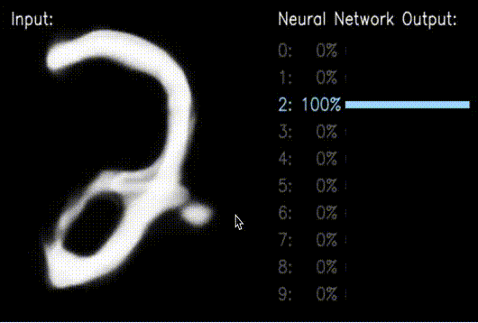

# Number_recognition
### Number recognition using Tensorflow on MNIST dataset Using CNN
[](https://colab.research.google.com/github/Mithunprb/Number_recognition/blob/master/NumRender.ipynb)
<br>
CNN is an acronym for **Convolutional neural network** 
CNN is type of a artificial neural network used in image recognition and processing
<br>


<br>
Output: <br>
<!-- 
 -->
 <p align="center">
  
  </p>
  
## Requirements
* For .ibpy file 
   1. Jupyter notebook or Google colab 
      * For Jupyter notebook : <br>
      [Install Jupyter Notebook](https://jupyterlab.readthedocs.io/en/stable/getting_started/installation.html)
      * For Google Colab : <br>
       [How to use Google Colab](https://colab.research.google.com/notebooks/intro.ipynb?utm_source=scs-index#)
    1. Next :<br>
       * Use Python 3.x or grater <br> 
       * Install TensorFlow
          ```bash
          pip install tensorflow
          ```
       * Install matplotlib
          ```bash
          pip install matplotlib
          ```


<!-- <br><br>
* For .py file 
  1. Use Python 3.x or greater <br>
  1. Install TensorFlow <br>
      * Using pip <br>
    `
    pip install tensorflow
    `
  1. Install matplotlib <br>
    * Using pip <br>
    `
    pip install matplotlib
    `
    <br> -->
    
      
    
